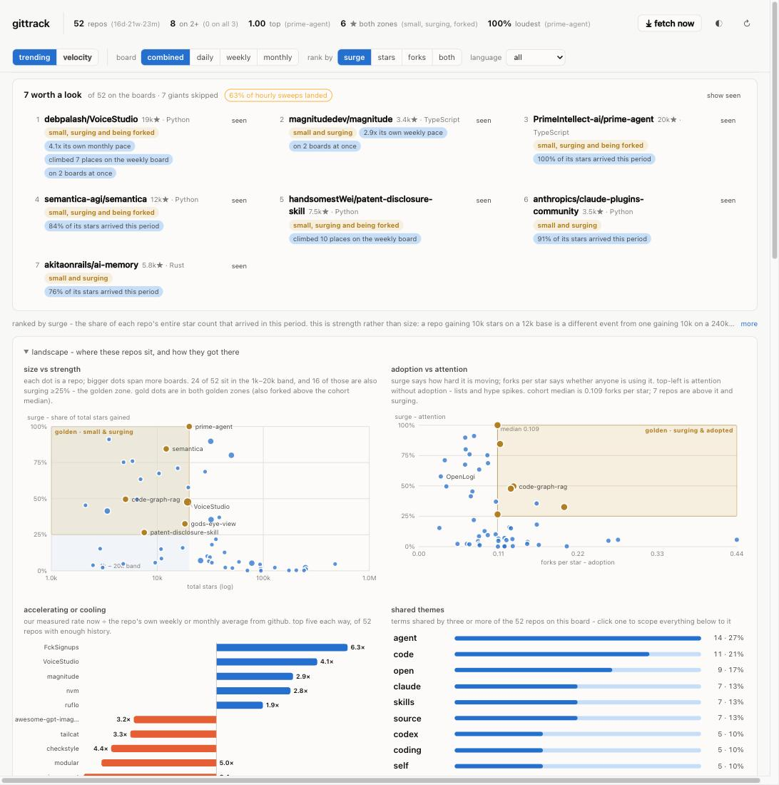
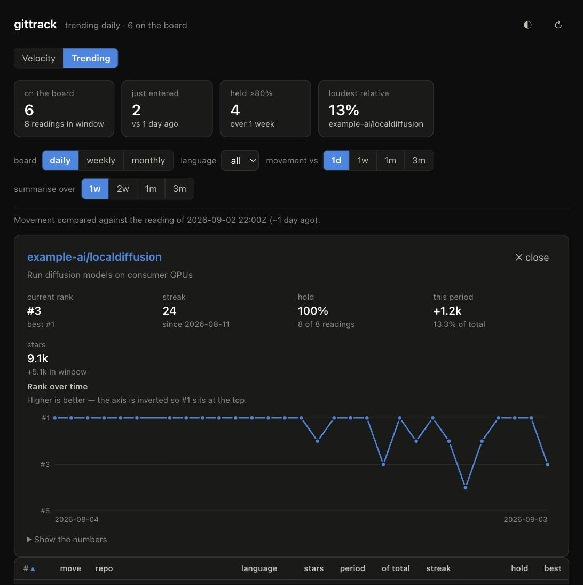
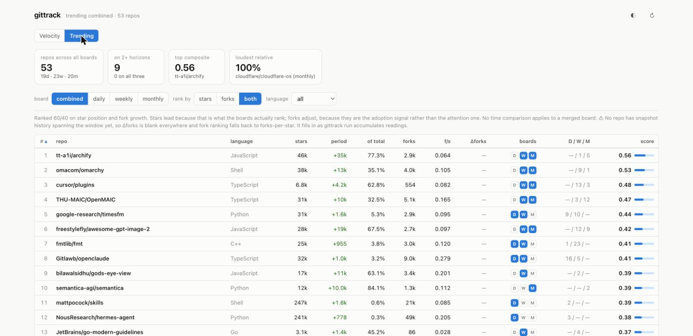
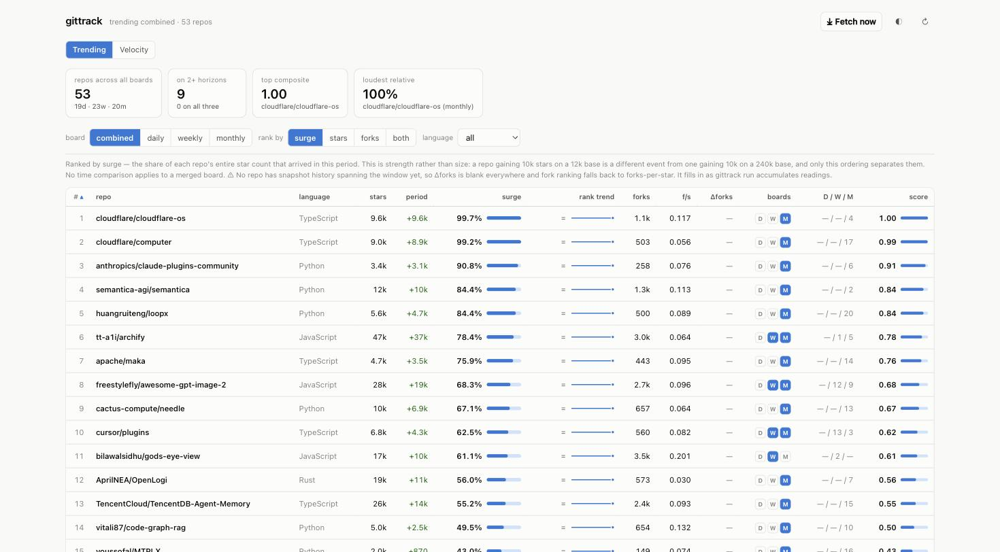
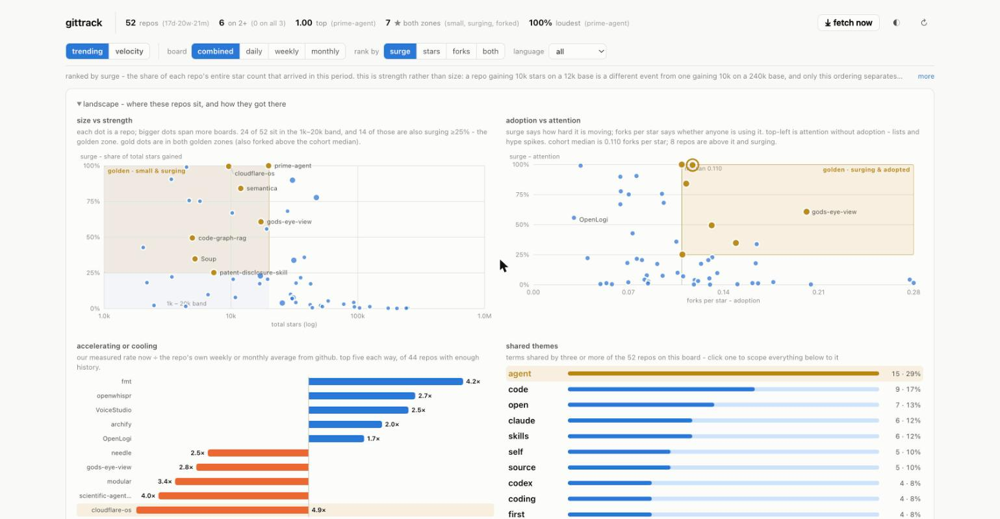
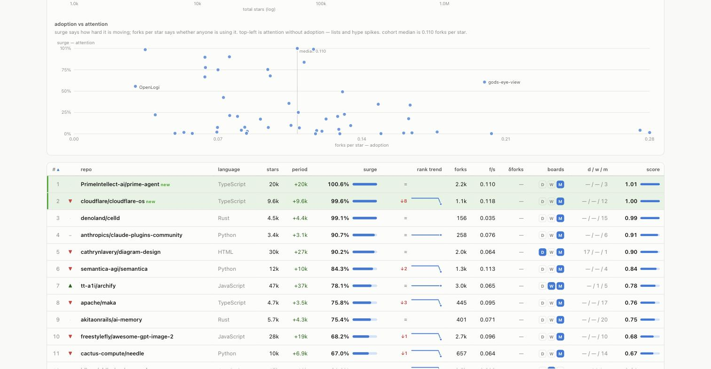
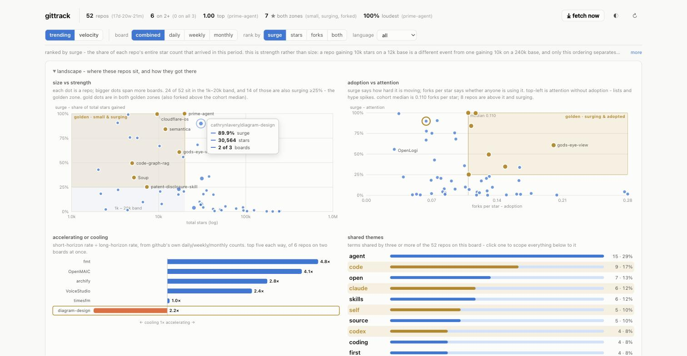

# gittrack

Spot GitHub repos gaining **abnormal** traction, not repos that are merely large.



gittrack snapshots GitHub Trending and the top-N repos by stars, stores the
history, and ranks by how unusual a repo's current growth is against its own
past and against everything else on the board.

The distinction it is built around: `mattpocock/skills` gaining 1,600 stars and
`google-research/timesfm` gaining 1,600 look identical on any raw count. The
first is 0.6% of a 247,000-star base; the second is 5.3% of a 31,000-star base.
Only one of those is an event. Ranked by **surge** - the share of a repo's entire
star count that arrived in this period - the top of the board fills with repos
whose whole life happened inside the window.

```
 1  cloudflare/cloudflare-os              99.7%  ###########################
 2  cloudflare/computer                   99.2%  ###########################
 3  anthropics/claude-plugins-community   90.8%  #########################
```

**What it does**

- Reads GitHub Trending (daily / weekly / monthly, per language) on a schedule.
  No API quota: it is a public HTML page.
- Snapshots stars and forks over time into SQLite, and computes velocity,
  acceleration, and a robust z-score against each repo's own baseline.
- Serves a local dashboard with linked charts, a golden-zone overlay, and
  relationship analysis across the board.
- Reports honestly when it does not have enough history yet, rather than
  inventing a number.

**Status:** alpha, and useful from day one, but the signals that need history
(rank trend, fork growth, z-scores) fill in over the first days of running.


## The digest: what deserves attention, and why

```
$ gittrack digest

7 worth a look  of 52 on the boards; 7 giants and 0 seen skipped

 1. debpalash/VoiceStudio  19k*  Python
      * small, surging and being forked
      * 4.1x its own monthly pace
      * climbed 7 places on the weekly board
      * on 2 boards at once
      https://github.com/debpalash/VoiceStudio
 ...
```

This is the product. The charts and the table are evidence; the digest is the
answer. It sits at the top of the dashboard and is one command in the terminal.

It is built only from signals that work on day one - the merged board, surge,
acceleration, fork adoption and rank movement - and **every entry states its
reasons in plain words**, so you can disagree with it. Two exclusions do most of
the work:

- **Saturated giants** (over 100k stars by default) are never the answer. A
  250k-star project cannot gain 60% of itself in a week.
- **Repos you have marked seen** are skipped, so the list is new each morning
  rather than the same names in the same order.

```bash
gittrack seen owner/name --note "looked, real"   # the digest moves on
gittrack seen --list
gittrack seen owner/name --undo
gittrack digest --include-seen
gittrack digest --json                            # for piping anywhere
```

### Being told, instead of checking

"Before anybody" is a property of being *told*, not of having a dashboard. Every
hourly sweep rebuilds the digest and compares it with the last one; repos that
newly entered trigger a notification. Two channels to start:

```toml
[notify]
macos = true          # macOS notification centre
slack_webhook = ""    # an incoming-webhook URL; empty disables
on_new_only = true
```

A failed notification never fails the sweep that produced it. Turn it off for a
single run with `gittrack run --no-notify`, or fire one by hand with
`gittrack digest --notify`.

### Coverage: knowing when the data is thin

A laptop that sleeps overnight silently drops readings, and the numbers still
look fine. `gittrack status` and the digest header now report **coverage** - the
share of scheduled sweeps that actually landed, and the largest hole:

```
coverage      30 of ~49 hourly sweeps landed (61%)  largest gap 10.5h - the machine sleeps
```

A quiet digest is only trustworthy if you know the collector was awake. If the
number is low, see *Where to take it next* for the fix.

## Read this before you trust the top 100

The default universe is the top 100 repos by absolute stars. **Nothing there will
ever break out.** `freeCodeCamp`, `linux`, and the various `awesome-*` lists
accrete stars on a near-flat line; they are saturated. Their real job here is to
be the *calibration set* - they define what normal growth looks like, which is
what makes a z-score mean anything.

The alpha lives in repos with roughly **1,000–20,000 stars**, where a 3× jump in
weekly rate is both real and meaningful.

**How deep does `top_n` have to go to get there?** Measured against the live API
(September 2026, `fork:false archived:false`):

| `top_n` | reaches down to | search calls per run |
|---:|---:|---:|
| 127 | 100,000 stars | 2 |
| 474 | 50,000 stars | 5 |
| 2,166 | 20,000 stars | 22 |
| 5,239 | 10,000 stars | 53 |
| 11,692 | 5,000 stars | 117 |
| 30,584 | 2,000 stars | 306 |
| 59,288 | 1,000 stars | 593 |

So the hunting band starts at rank ~2,166 and doesn't end until ~59,288. A
`top_n` of a few thousand only skims its top edge. Budget the cadence against the
right-hand column: authenticated search allows 30 calls/min, so `top_n = 30000`
is about 10 minutes per run - comfortable at a 6-hourly cadence, not at an
hourly one.

Once you have a week of history:

```toml
# gittrack.toml
[universe]
top_n = 30000       # discovery slices the star axis automatically past the
                    # search API's 1000-result cap
min_stars = 1000
max_straggler_fetches = 200
```

```bash
GITTRACK_INTERVAL=21600 ./scripts/launchd/install.sh   # 6-hourly
```

```bash
gittrack top --max-stars 20000 --by heat
```

## Install

```bash
uv venv && uv pip install -e .
```

Authenticate - unauthenticated limits (60 req/hr) are enough to try it, not to
run it:

```bash
gh auth login          # gittrack picks this up automatically
# or: export GITHUB_TOKEN=ghp_...
```

## Quickstart

```bash
gittrack init          # writes gittrack.toml + gittrack.db
                       # (gittrack.example.toml shows every option with defaults)
gittrack run           # first snapshot: the whole top 100 costs ONE API call
gittrack status
```

Then put it on a schedule. On macOS, launchd is the native option and survives
reboots:

```bash
./scripts/launchd/install.sh      # hourly ingest + dashboard on 127.0.0.1:8787
./scripts/launchd/uninstall.sh    # removes both; leaves the database alone
```

That installs two per-user LaunchAgents:

| Agent | What it does | Every | Log |
|---|---|---|---|
| `com.gittrack.ingest` | snapshot every trending board and diff it | 1h | `ingest.log` |
| `com.gittrack.enrich` | the API pass - metadata, and history for repos no board lists | 6h | `enrich.log` |
| `com.gittrack.dashboard` | keeps the dashboard up, restarts if it exits | - | `dashboard.log` |

**The two jobs are split because their costs are nothing alike.** The trending
sweep is a plain HTTP GET per board - no API quota at all - so it can run hourly
forever. The API pass is rate-limit bound (60 req/hr unauthenticated), so it runs
rarely and catches up over several passes. Keeping them on one clock meant an
exhausted rate limit could stall the boards, which are the part that costs
nothing and carries most of the signal.

A sweep of 24 boards takes about 80 seconds - there is a configurable
`request_delay` between fetches, because this is someone else's server - so the
hourly job sits at roughly a 2% duty cycle. Both intervals are tunable:

```bash
GITTRACK_INTERVAL=3600 GITTRACK_ENRICH_INTERVAL=21600 ./scripts/launchd/install.sh
```

Every sweep leaves a row in `runs`, so `gittrack status` answers "did the hourly
job actually fire?" - not just for the API pass but for the boards too.

Run either half by hand:

```bash
gittrack run --trending-only   # boards only, zero API quota
gittrack run --no-trending     # the API pass only
gittrack run                   # both
```

The installer puts `gh`'s directory on the agents' `PATH`, so the moment you run
`gh auth login` the scheduled runs start using the token - no edit, no reload.

Check on them with `launchctl list | grep gittrack` (a `-` PID on the ingest agent
is normal - it's periodic, so it runs and exits; the second column is its last
exit code).

Elsewhere, cron does the same job:

```cron
0 * * * * cd /path/to/gittrack && .venv/bin/gittrack run >> gittrack.log 2>&1
```

The ingest writer and the dashboard reader share the database safely: SQLite runs
in WAL mode and the server opens a fresh connection per request.

Velocity appears once snapshots span your window (7 days by default). Until
then `gittrack top` will tell you so rather than invent numbers.

```bash
gittrack serve         # dashboard on http://127.0.0.1:8787
```

## Commands

| Command | What it does |
|---|---|
| `gittrack digest` | The shortlist: what deserves attention right now, and why. `--json`, `--notify`, `--include-seen` |
| `gittrack seen owner/name` | Mark a repo reviewed so the digest moves on. `--note`, `--undo`, `--list` |
| `gittrack run` | Discover + snapshot + trending sweep + digest + notify. This is what cron calls. |
| `gittrack top` | The leaderboard. `--by heat\|z\|velocity\|rel-velocity\|accel\|stars`, `--window`, `--min-stars`, `--max-stars`, `--language`, `--max-age-days`, `--min-z`, `--spark`, `--json`, `--csv` |
| `gittrack trending` | Read GitHub Trending and diff it against a previous reading. Costs no API quota. |
| `gittrack show owner/repo` | Every metric for one repo, plus a 30-day sparkline. |
| `gittrack watch add\|rm\|list` | Repos tracked regardless of rank. Mirrored back into the config file. |
| `gittrack backfill owner/repo` | Reconstruct real star history immediately (see below). |
| `gittrack status --rate-limit` | Coverage, run health, remaining API quota. |
| `gittrack compact --keep-days 30` | Downsample old snapshots to one per day. |
| `gittrack serve` | The dashboard. |

## Trending: the discovery half

Polling a top-N universe can only re-rank repos you already chose. GitHub
Trending is the other half - it surfaces repos you are **not** tracking yet, it
is exactly the small-and-accelerating band worth hunting, and it costs **no API
quota** because it is a public HTML page.

```bash
gittrack trending                      # current board + what changed since last reading
gittrack trending --since weekly       # GitHub's weekly board
gittrack trending --language rust      # a per-language board
```

Repos seen on trending are added to the tracked universe automatically
(`auto_track`), so they start accumulating real history from the moment they
appear. `gittrack run` reads the configured boards every cycle.

### Two independent time axes

These are different things and it matters:

- **`--since daily|weekly|monthly`** - which board GitHub computes.
- **`--compare PERIOD` / `--over PERIOD`** - *your* comparison window.

```bash
gittrack trending --compare 1d         # day over day
gittrack trending --compare 1w         # week over week
gittrack trending --compare 3m         # vs a quarter ago
gittrack trending --over 2w            # aggregate every reading in the last 2 weeks
gittrack trending --over 1m --no-fetch # stored readings only, no network
```

Periods accept `12h`, `3d`, `2w`, `6m`, `1y`; a bare unit means one (`w` = 1
week) and a bare number means days. Anything else is rejected rather than
silently compared against the wrong window.

Readings are irregular (the scheduler drifts, runs fail), so "a week ago" means
*the reading nearest a week ago* - and only within half a period. Beyond that
gittrack says there is nothing comparable rather than diffing against the wrong
week.

### Fetching from the dashboard

**Fetch now** in the header pulls fresh data and stores it, without leaving the
page. It does the right thing per view: on Trending it reads the boards the
current view needs (all three for the combined board, one otherwise); on Velocity
it runs a full API snapshot pass.

The fetch runs in a worker rather than inside the request, because it writes to
the database and reaches out over the network - a trending sweep takes several
seconds and a snapshot pass can sleep on a rate limit for minutes. The page polls
and streams each step as it lands, so you see `daily/all: 19 rows` before the
weekly board has even started. It is a POST, so no prefetch or stray GET can
trigger it, and a second click while one is running adopts the running job
instead of starting a rival.

Everything else in the dashboard stays read-only: `↻` re-reads stored data and
never scrapes.

### In the dashboard

`gittrack serve` has a **Trending** view alongside the velocity leaderboard: the
current board with rank movement and hold meters, the two period selectors, and
a rank-over-time chart per repo (the axis is inverted, so a line going *up* means
the repo is climbing).



*(Shown with demo data.)* The dashboard never triggers a scrape - it reads stored
readings only, so opening the page never depends on network luck and never
hammers GitHub on refresh. `gittrack run` is what fetches.

### The combined board

`daily`, `weekly` and `monthly` are three views of the same thing, and a repo's
position across all three says more than any one of them. The **combined** board
merges them:



Each board contributes a *normalised* position - rank 1 scores 1.0, last scores
~0, absent scores 0 - summed across the three. Normalising by each board's own
length matters because they are not the same size (19 / 23 / 20 on a given day),
so a raw rank would quietly weight the shortest board heaviest. Reaching the top
therefore needs both a high placing **and** presence on more than one horizon:
sustained traction rather than one loud day.

The payoff is that the combined top looks nothing like the daily top. On the day
this was captured, `tt-a1i/archify` led the combined board - #1 weekly, #5
monthly, **77% of its total stars gained that month** - and it was not on the
daily board at all.

The `D / W / M` chips and positions column show exactly where a repo sits on each
board, so a one-day spike (`D` alone) is visually distinct from something
compounding across horizons.

Clicking a repo **name** opens it on GitHub in a new tab; clicking anywhere else
on the row opens the detail panel. Two targets, one row.

### Seeing strength, not just size

Trending is the default view, and it leads with **surge** - the share of a repo's
*entire* star count that arrived in the selected period.



That distinction is the whole point. `mattpocock/skills` gaining 1.6k stars and
`google-research/timesfm` gaining 1.6k look identical on any raw count, but the
first is 0.6% of a 247k base and the second is 5.3% of a 31k base. Only one of
those is an event. Ranked by surge, the top of the board fills with repos whose
*entire life* happened in this window - 99.7%, 99.2%, 90.8% - which is as close
to "abnormally gaining traction" as a single number gets.

Two visual channels carry it:

- **Surge bar.** Linear on a 0–100% domain, because the value is already a
  percentage of the repo's own total - no scale trickery, a short bar honestly
  means a small share.
- **Rank trend.** A sparkline of the repo's rank over the period, *inverted* so a
  line going up means climbing, with a net-move chip beside it. Readers expect up
  to be better; a raw rank axis inverts that.

`rank by` reorders the whole board: `surge` (strength), `stars` (position across
boards), `forks`, or `both`.

### The landscape

Above the table sit three charts answering *where these repos sit* and *how hard
they are moving*.



A repo can sit in one golden zone or both, and **both is the answer the page
exists to give**: small, moving hard, *and* actually being forked. Those repos
are painted gold in both scatters (so the same dot is recognisable across charts
without cross-referencing names), named directly on the size chart, given a gold
★ and a tinted row in the table, and counted in the header. All four are computed
from one shared membership set, so they cannot drift apart.

Both scatters mark a **golden zone** - the corner where you actually want to
find something - as a washed rectangle with a hairline edge and a stated
threshold, and the note under each chart says how many repos are inside it.

**Size vs strength.** Total stars on a log x-axis against surge on a linear y.
Log x is load-bearing, not decorative: stars span three orders of magnitude, and
on a linear scale every small repo collapses onto the left edge - precisely the
band worth looking at. The shape it draws is the thesis of the whole tool. The
cloud slopes down and right, because **high surge only ever happens at low star
counts**: a 250k-star project cannot gain 60% of itself in a week, a 3k-star one
can. The golden zone is the 1k–20k band **and** surge ≥25%: small and moving
hard at once, which is the only combination the whole tool is looking for. Dot
radius carries how many boards a repo spans.

**Accelerating or cooling.** The one signal that needs no history at all. The same
repo appears on the daily, weekly and monthly boards carrying "stars today",
"stars this week" and "stars this month". Reduce each to stars/day and the ratio
between a short and a long horizon says whether a repo is pulling away from its
own recent pace - `fmtlib/fmt` at 963/day against a 142/day weekly average is
running **6.8×** its own week. Bar length is log2 of the ratio, so 4× and ¼× sit
equally far from the baseline; the domain always contains 1× but is otherwise
data-driven, so with nothing cooling it renders as an ordinary bar chart rather
than a diverging one with a dead half.

**Adoption vs attention.** Surge says how hard a repo is moving; forks-per-star
says whether anyone is actually using it. Curated lists and hype spikes sit
top-left - stars pouring in, nobody forking. Real tools climb the right-hand
side. A reference line marks the cohort median, and the golden zone is
everything above that line that is also surging - moving hard *and* being used.

### The direction column

A single glyph per row says whether a repo is gaining or losing steam. It is
built on an explicit precedence rather than a blend, because the two available
signals are not equally good:

1. **Acceleration** - its current rate against its own longer-horizon rate.
   Available whenever a repo sits on two boards at once, and it needs no stored
   history at all, which makes it the strongest thing available today.
2. **Rank movement** - only meaningful once several readings exist.

A neutral band around 1× keeps ordinary noise from flipping the arrow every
sweep, and the tooltip always names the basis used - an arrow that silently
changed meaning between rows would be worse than no arrow. Direction is sortable,
and sorts by *how hard* a repo is moving, so a 6.8× outranks a 1.2× rather than
both being lumped under "up".

▲ and ▼ differ in shape, not just colour, so the column survives greyscale and
any form of colour blindness.

### One layout, every board

`combined`, `daily`, `weekly` and `monthly` all render through the same columns
and the same row renderer. The per-board variant used to carry `move`, `streak`
and `hold` - all of which the direction glyph and the rank-trend column now
express - so keeping two renderers only bought drift between them.

### What changed on the last fetch

Pressing **fetch now** diffs the board against what was on screen before it.
Arrivals get a green tint and a `new` tag; departures are kept as **ghost rows**
with a red tint and a `dropped off` tag, because a repo falling off a board is at
least as interesting as one joining it and cannot be seen at all if it simply
vanishes on refresh. Their rank shows as `-` rather than a stale number.



The highlight clears itself after twenty seconds - it is a transient cue, not a
state, and a board left open should not still be claiming these are new an hour
later.

### Clicking is linked

Selecting a repo - in any chart, or in the table - highlights it **everywhere**:
ringed and named in both scatters, banded in the acceleration bars, with every
other mark dimmed, the table row flagged and scrolled into view, and the detail
panel opened. Clicking the same repo again clears it, so a chart click is
reversible without hunting for a close button.

That linking is what makes three charts of the same 53 repos worth having: you
find something interesting in one view and immediately see where it stands in the
others.

## Relationships between repos

Three kinds, in descending order of how far they can be trusted.



**Shared themes** are the useful one. Terms appearing in three or more repos'
name and description, with the share of the board each reaches. When 29% of the
board says *agent*, the wave is the story and no individual repo on it is.
Hovering one previews its members across every chart; hovering a repo anywhere
lights the themes it belongs to, so the link reads in both directions. Clicking a
theme pins it, scoping the table and dimming non-members. The owner
is deliberately excluded from the tokens: including it would make every repo by
one author look thematically linked to itself.

**Same owner** is exact and has no false positives. One organisation putting
several repos on the board at once is a deliberate act.

**Moving together** - repos that appear and vanish in lockstep - is reported as
*cohorts*, not pairs, and this is the part that needed the most care. Eight repos
turning over in one board refresh produce twenty-eight pairs at a perfect
correlation score, which reads like twenty-eight discoveries and is really one
event. Grouping by identical presence says the true thing, and a block of five or
more is flagged as *probably the board turning over, not affinity*. It is also
gated behind eight readings, because with fewer, "always together" only means
"arrived in the same sweep".

Repos present in *every* reading are excluded throughout: permanence is not
correlation.

### Forks

**GitHub publishes no forks board** - Trending ranks by stars only - so fork
signal is derived from our own snapshots rather than scraped. Two different
things come out of that, and they have different availability:

| Signal | What it says | Available |
|---|---|---|
| `f/s` (forks per star) | Is this repo *used*, or just bookmarked? | Immediately |
| `Δforks` | Fork growth over the window | Once snapshot history spans the window |

`Δforks` reports blank rather than zero until the history exists, so "no data
yet" never masquerades as "flat". Until then the fork ranking falls back to
forks-per-star, and the dashboard says so rather than showing an empty column.

**rank by** switches the combined board between `stars`, `forks`, and `both`
(60/40 - stars lead because that is what the boards actually rank; forks adjust,
because they are the adoption signal rather than the attention one).

### What the columns tell you

`gittrack trending` shows rank movement (`NEW`, `↑3`, `↓2`), the current
streak, and **`of total`** - what share of the repo's entire star count arrived
in this period. That last one is the signal: a repo gaining 1,576 stars on a
247,000-star base (0.6%) is much quieter than one gaining 1,600 on a 31,000-star
base (5.3%), even though the raw numbers look similar.

`--over` adds **`hold`** - the share of readings in the window where the repo
held a place. A repo on 14 of the last 14 daily boards is compounding; one that
appeared once had an afternoon. Both look identical on any single reading, and
comparing two windows separates them further: a repo showing 65% hold over a
month but 100% over two weeks is a recent arrival that has held every day since.

## How the scoring works

Four independent questions, each visible as its own column so the ranking is
never a black box:

| Signal | Question | Column |
|---|---|---|
| **Robust z** | Is this fast *for this repo*? | `z` |
| **Relative velocity** | Is this fast *compared to everyone*? | `rel` |
| **Acceleration** | Is the rate itself still climbing? | `accel` |
| **Fork confirmation** | Are forks moving too? | `fork✓` |

`heat` combines them (weights are in `[scoring]`), with fork confirmation acting
as a quality multiplier rather than an additive term - so a star-only spike gets
demoted rather than filtered out, and you can still see it.

### Four decisions that make the numbers trustworthy

1. **Snapshots are interpolated, never assumed evenly spaced.** Cron misses runs
   and laptops sleep. Every window is measured by interpolating between the two
   bracketing observations, so a missed run doesn't distort a 7-day delta. Outside
   the observed range the answer is "unknown" - it never extrapolates.

2. **The baseline excludes the current window.** Asking "are the last 7 days
   abnormal?" against a 90-day baseline that *contains* those 7 days lets a spike
   contaminate its own reference. The baseline runs
   `[now - 90d, now - 7d)`.

3. **Median/MAD, not mean/stdev.** Star velocity is heavy-tailed. One past Hacker
   News hit inflates a standard deviation so much that the next genuine surge
   scores z ≈ 1. The scale is floored at `sqrt(median)` because star arrivals are
   a counting process - even a perfectly steady repo has noise of order
   sqrt(rate), and without that floor a repo doing an unwavering 3/day would score
   z in the hundreds the first day it did 4.

4. **New repos are not breakouts.** A repo discovered yesterday has no baseline,
   so its `z` is `None` and it reports *insufficient data* - never an infinite
   score. This is the single most common way this kind of tool produces garbage.

`tests/test_metrics.py` asserts all of this, including that a steady 200/day repo
scores z < 1.5 while a genuine spike scores z > 8.

## Backfill: history without waiting

`gittrack backfill owner/repo` reconstructs the **real** star curve from
per-star timestamps (`Accept: application/vnd.github.star+json`), so a repo goes
from no history to a full curve in one command instead of six weeks.

- Costs one request per 100 stars - a 5,000-star repo is 50 requests.
- **Only works below ~40,000 stars.** GitHub's stargazers endpoint stops
  paginating at 400 pages and reaches only the *oldest* stars, so above that
  ceiling recent history is unreachable. gittrack refuses rather than writing
  something misleading.
- Backfilled rows carry `NULL` forks, because that endpoint has no fork history.
  Inventing a flat fork line would make every backfilled repo look like a
  star-only pump.

## API cost

The top-N snapshot rides the **search** endpoint, which returns 100 complete repo
objects per request - so the whole top 100 costs **one API call**. Watchlist
repos and anything that has dropped out of the top N are fetched individually
with `If-None-Match`; a 304 costs no quota at all and the previous values are
carried forward.

| Universe | Cost per hourly run | Against 5000/hr |
|---|---|---|
| top 100 | ~1–2 calls | negligible |
| top 1,000 | ~10–15 calls | negligible |
| top 10,000 | ~100–150 calls | fine |

## Storage

SQLite, WAL mode. `snapshots` is the time series (`repo_id`, `ts`, `stars`,
`forks`, …) keyed on GitHub's numeric repo id, which survives renames and
transfers. 100 repos polled hourly is ~876k rows/year - trivial. At 10,000 repos
run `gittrack compact` periodically.

## Development

```bash
.venv/bin/python -m pytest tests/ -q
python scripts/seed_demo.py demo.db && gittrack --db demo.db serve
```

`scripts/seed_demo.py` generates synthetic history - a saturated giant, steady
mid-tail projects, a genuine breakout, a star-only pump, a young compounder, and
an old spike that must *not* score as hot today. Repo names there are fictional
on purpose: attaching invented numbers to real projects would produce a
screenshot that lies.

## Where to take it next

The real "before anybody" upgrade is **GH Archive** (`gharchive.org`): the hourly
firehose of every `WatchEvent` and `ForkEvent` on GitHub, free as gzipped JSON.
That surfaces repos you aren't tracking yet - this design polls a universe you've
already chosen. The `snapshots` schema takes that data unchanged; it needs an
ingester, not a rewrite.

## License

MIT. See [LICENSE](LICENSE).
